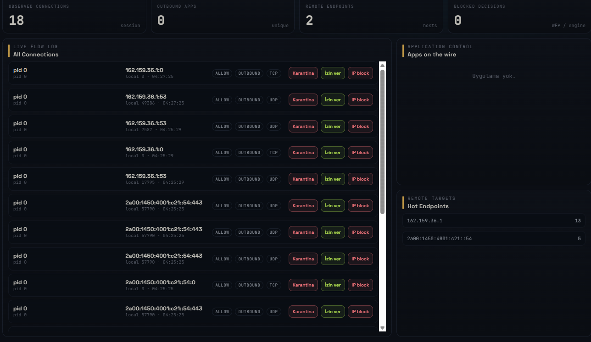
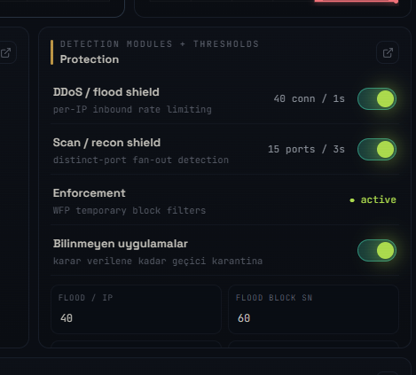
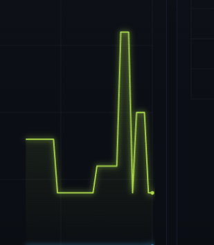

# m0untain

**m0untain** is an experimental Windows host firewall and network control cockpit built with **Rust**, **Tauri**, and the **Windows Filtering Platform (WFP)**.

It watches live network activity, asks before newly observed applications are allowed to talk to the internet, lets you quarantine apps for the current session or permanently, and presents the machine's traffic in a dark, signal-driven UI inspired by simplewall-style control and GlassWire-style visibility.

_TR: m0untain; Rust/Tauri ile yazılmış, Windows WFP üstünde çalışan deneysel bir firewall ve ağ kontrol panelidir._

> Security note: this is a work-in-progress personal firewall project. It can install WFP rules and block/quarantine applications, but it has not been independently audited. Run it as administrator on Windows and treat it as an evolving security tool, not yet as a hardened enterprise firewall.

_TR: Güvenlik aracı olduğu için dürüst not: proje aktif geliştirme aşamasında; gerçek sistemlerde dikkatli test edilmelidir._

## Screenshots

### Connections and Application Control



The **Connections** view groups observed traffic by application/process, shows remote endpoints, blocked decisions, live flow counts, and a side panel for the selected process.

_TR: Bu ekran, internete çıkan uygulamaları/processleri ve bağlı oldukları hedefleri tek yerden yönetmek için tasarlandı._

### Protection Modules



Protection modules expose live toggles for flood protection, scan/recon detection, WFP enforcement, and unknown-application quarantine behavior.

_TR: Koruma modülleri canlı açılıp kapanabilir; bilinmeyen uygulamalar karar verilene kadar karantinada tutulabilir._

### Live Traffic Signal



The dashboard keeps a compact live signal chart for immediate traffic feedback.

_TR: Canlı trafik sinyali, ağ hareketini hızlıca hissettiren küçük bir metrik alanıdır._

## What it does

- Observes active TCP/UDP connections on Windows and maps them back to process IDs and executable paths.
- Prompts the user at least once for newly observed internet-facing applications when "ask new apps" mode is enabled.
- Supports **Allow** and **Quarantine** decisions with a selectable protocol scope: TCP, UDP, or both.
- Supports V2 profiles: **Home**, **Public Wi-Fi**, **Gaming**, **Work**, and **Lockdown**.
- Supports timed decisions: allow once, 10 minutes, 1 hour, session-only, or remembered.
- Stores rule metadata by app, profile, protocol, direction, optional target, expiry, and timestamps.
- Stores remembered decisions persistently and keeps non-remembered decisions alive for the current m0untain session.
- Tracks offline-first risk labels, notification history, JSON import/export, and verified kill-process actions.
- Installs WFP application block filters for quarantined apps.
- Shows a simplewall-like application inventory: pending, allowed, quarantined/blocked, and observed-but-unruled apps.
- Shows a GlassWire-like connections page with application trees, endpoints, protocols, directions, and hot remote targets.
- Includes IDS-style detection for inbound per-IP flood/DDoS pressure and port-scan/recon patterns.
- Can stay alive in the tray when the window is closed.
- Can be configured to launch at Windows startup.

_TR: Özetle; uygulama bazlı izin/karantina, canlı bağlantı takibi, WFP engelleme ve IDS metriklerini tek arayüzde toplar._

## Project layout

```text
core/          Detection engine, config, verdicts, metrics, tests
src-tauri/    Tauri desktop shell, WFP backend, settings, tray, snapshots
service/      V2 Windows service scaffold for future boot-time default-deny enforcement
ui/           Single-file dark dashboard and firewall control UI
docs/         README screenshots and documentation assets
```

_TR: Ağ ve güvenlik mantığı Rust tarafında, arayüz ise Tauri içinde çalışan web UI tarafında tutuluyor._

## Requirements

- Windows 10/11
- Rust with the MSVC toolchain
- Visual Studio C++ Build Tools
- Microsoft Edge WebView2 Runtime
- Tauri CLI v2

```powershell
cargo install tauri-cli --version "^2"
```

_TR: WFP kuralları için uygulamayı Windows'ta yönetici olarak çalıştırmak gerekir._

## Run

From the project root:

```powershell
cargo test --workspace
cargo tauri dev
```

For a release build:

```powershell
cargo build -p m0untain --release
cargo tauri build
```

The release binary is produced under:

```text
target/release/m0untain.exe
```

The installer bundle is produced under Tauri's bundle output directory when `cargo tauri build` is used.

_TR: Geliştirme sırasında `cargo tauri dev`, hızlı test için `cargo test --workspace`, dağıtım için `cargo tauri build` kullanılır._

## Usage flow

1. Start m0untain as administrator.
2. Enable protection modules and "ask new apps" mode.
3. When an application attempts to connect, choose:
   - **Allow**: let it connect.
   - **Quarantine**: block the application with WFP rules.
4. Pick the decision scope: TCP, UDP, or all traffic.
5. Pick duration: allow once, 10 minutes, 1 hour, session-only, or remembered.
6. Switch profiles when needed, for example Public Wi-Fi or Lockdown.
7. Use the **Connections** page to inspect observed apps, endpoints, blocked traffic, risk labels, and live targets.
8. Use the **History** page to audit prompts, rules, blocks, expiry events, imports, and emergency actions.

_TR: Amaç, yabancı veya beklenmeyen bir uygulama internete çıkmaya çalıştığında veri sızdırmadan önce kullanıcıdan karar almaktır._

## Current status

- Rust workspace builds successfully.
- Core detection tests pass.
- Windows WFP integration compiles and installs app quarantine filters.
- Active connection snapshots are collected through Windows IP Helper APIs.
- Rule Engine V2 schema is active with profile-aware, timed, directional, protocol-aware, and target-aware rule metadata.
- UI includes dashboard cards, focus animations, profile selector, connection trees, filters, quarantine controls, timed app decision prompts, target rule actions, notification history, import/export, tray behavior, and startup settings.
- The `service/` crate is present as the staged home for a future boot-time/default-deny Windows service.

_TR: Proje çalışır durumda; güvenlik davranışları ve UI akışı hâlâ geliştirilmeye açık._

## Improvement Ideas

V2 foundations have landed. The next staged upgrades are:

- Implement the Windows service install/start UX and move default-deny enforcement into that always-on service.
- Enforce app+target rules directly in WFP with remote address/port conditions instead of app-wide fallback blocks.
- Add real executable icons by extracting Windows shell icons and caching them as app metadata.
- Add DNS cache correlation and reverse-DNS history so IPs can be mapped to known domains when Windows can prove the relationship.
- Add real signature/publisher checks for stronger offline reputation labels.
- Add optional online reputation providers behind explicit API keys.
- Add per-application byte counters once packet/flow byte telemetry is available.

_TR: Bunlar projeyi daha gerçek bir “tam kontrol firewall” hissine taşıyacak sonraki adımlar._

## Development notes

- Dynamic WFP sessions are preferred so temporary filters are cleaned up when the app exits.
- Persistent app/profile/target rules are stored in the app settings layer as `state.json` schema v2.
- Session-only app rules remain active while m0untain is open.
- Timed rules are pruned automatically when they expire and emit history events.
- Online reputation is off by default; the current risk model is offline-first.
- If the service is offline, m0untain clearly reports "app-only protection" and continues with UI-session WFP controls.
- The first observed connection may already have reached Windows before a user decision is made; stronger pre-connection default-deny behavior should be implemented as a dedicated service/filter strategy.

_TR: En güçlü güvenlik için sonraki büyük adım, uygulama açılmadan da çalışan servis tabanlı default-deny mimarisi olacaktır._
